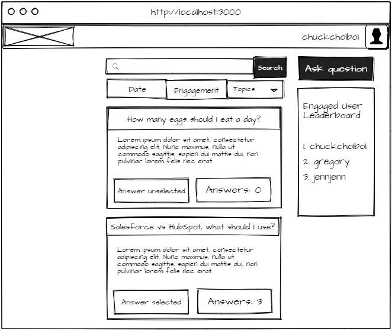
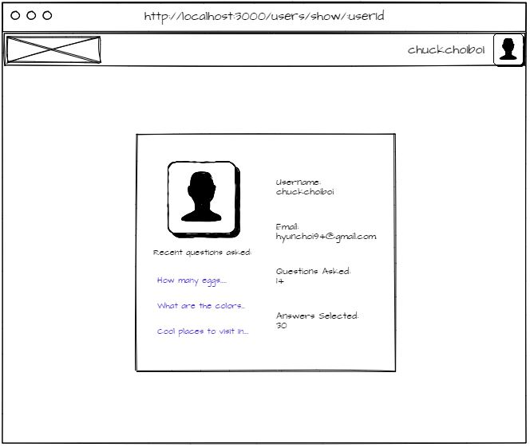
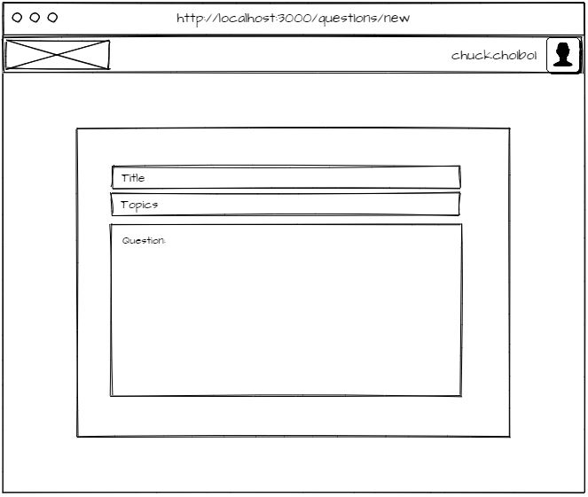
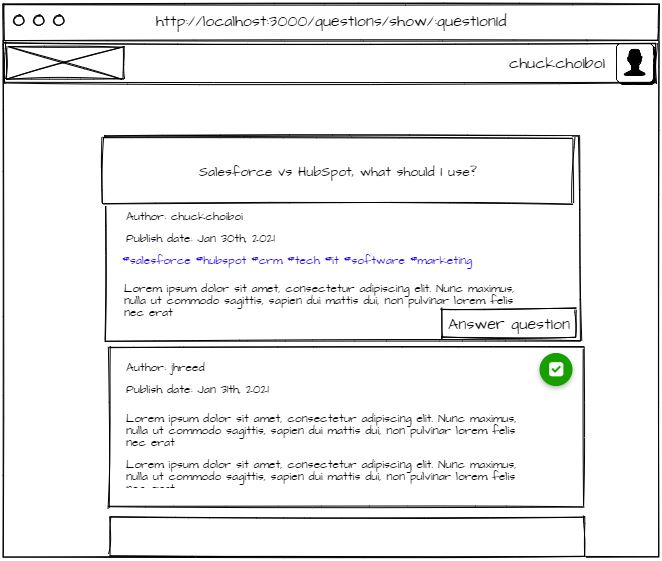
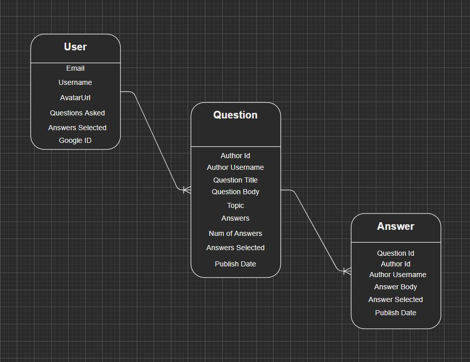

# **APP TITLE: BOOMERANG**

 
 

## APP SUMMARY

---

 
 

### **Wireframe**

#### Home Page

#### User Page

#### Question Page

 
 

### **User Stories**

1. As a user, I can login/logout using Google account
2. As a user, I can check my user detail that shows **email**, **username**, **number of questions asked**, and **number of answers selected** and **recent questions asked**. Username can be edited.
3. As a user, I can ask questions that can be answered by other users in the app, and have authorization to select answers in the questions I originally asked as "_selected_"
4. As a user, I can delete questions that I originally created
5. As a user, I can answer the questions in the app community which can be "_selected_" by the original author of the question
6. As a user, I can delete the answers I originally created in questions in the app
7. As a user, I can see the questions feed which can be sorted based on the engagement numbers, topics, publish date, or using keyword search

 
 

### **Data Models**

User

- Email: String, unique
- Username: String, unique
- Avatar URL: String, unique
- Questions asked: Number
- Answers selected: Number
- Google ID: String

Question

- Author ID: mongoose.Types.ObjectId, unique
- Author Username: String
- Question Title: String
- Question Body: String
- Topics: [String]
- Answers: [mongoose.Types.ObjectId]
- Publish Date: Date

Answer

- Question Id: mongoose.Types.ObjectId
- Author Id: mongoose.Types.ObjectId
- Author Username: String
- Answer Body: String
- Answer Selected: Boolean
- Publish Date

 
 

## TECHNOLOGIES USED

---

 
 

- Node Modules
  - dot-env
  - ejs
  - express
  - express-session
  - method-override
  - mongoose
  - passport
  - passport-google-oauth
- Bootstrap
- jQuery
- MongoDb
- Trello
- Mockflow
- Heroku
- GitHub

 
 

## Approach

---

 
 

- This app is an express app built using MongoDB as database and EJS as view engine
- Started off by summarizing userstories, and breaking down the components that are needed for this app to function
- Trello was used to break down the project timeline and break down the project in to multi-steps
- Most of the actions required authentication for the user, so started off by adding Oauth as authentication method, using passport/google strategy
- Followed the design pattern of MVC framework, working on each feature at a time
- The four CRUD functions are called to perform different types of operations called in HTTP requests
   
   

## NEXT STEPS

---

 
 

- Planning to add "view my questions" page to show list of questions created by the user that users can get to
- Notification functionality can be implemented to notify when there's engagement
