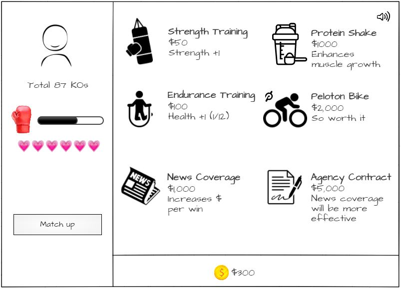

# Rocky Fist

## Concept:

Rock Paper Scissors association decided to challenge Rocky on rounds of rock paper scissors. Rocky may be a great boxer, but not a great RPS player. He has a pride as a boxer though, so he will only play rock. Upgrade his fist, make him do jump ropes to get stronger and beat the RPS association! Show them who the real champ is.

## Wireframes:

### Start Screen

### Match Up Screen

### Upgrade Screen

## Technologies Used:

    - HTML
    - CSS
    - Bootstrap
    - JavaScript

## Approach:

### UI:

    - Used bootstrap/flexbox to set the layout

### Code:

    - Started off declaring required constants
    - Separated game logic and render logic
        - Game logic contains objects and functions that makes the game logic run, player upgrades and initilize function to reset the game data
        - Render logic contains functions that makes the DOM render based on the game logic that is ran once the game starts
        - gamePlay array contains render functions that were stored based on the game logic that was ran

## Challenges:

Making the gamePlay to render after each previous gamePlay rendering function was difficult. setInterval() was used to have the gamePlay to render every second of interval as a solution. The interval will break if the player's health reaches 0, but if ran all the way through, the game ends and shows replay option

## Additional information:

### Instruction:

Once the game starts, you will play against the opponent for multiple rounds. You will get money for every win, lose health for every loss, and nothing will happen for every draw. Every time you beat a round, you will get round completion reward. The goal of the game is to complete all 5 rounds. It gets harder every round, so upgrade Rocky's stats to get stronger and beat the game!

### Win State:

Go through all 5 stages without losing all health

### Lose State:

Losing all health, but game will continue by taking you to upgrade screen to improve player stats

### Future Improvements:

    - add an intro with a story, instruction, and skip button
    - add visual changes to rocky's fist upon upgrades
    - change characters as round progresses
    - show #turns left per round

## App Demo

[App Link](https://chuckchoiboi.github.io/rocky-fist/)
